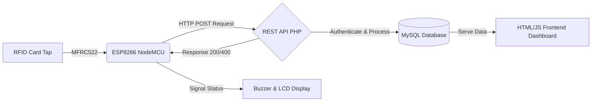

<div align="center">

# 🎓 Edu Track Pro
**Next-Generation IoT RFID Smart Attendance System**

[](https://opensource.org/licenses/MIT)
[](https://www.php.net/)
[](https://www.mysql.com/)
[](https://www.arduino.cc/)
[](CONTRIBUTING.md)

*A production-ready, highly scalable IoT attendance management platform that seamlessly bridges specialized hardware with a powerful, comprehensive web dashboard.*

[Features](#-key-features) • [Architecture](#-architecture--tech-stack) • [Hardware Requirements](#-hardware-components) • [Installation](#-quick-start-guide) • [API](#-api-reference)

</div>

---

## 🌟 Overview

**Edu Track Pro** automates the entire student attendance lifecycle, bringing schools and universities into the 21st century. Using highly responsive ESP8266 microcontrollers and MFRC522 RFID scanners, our hardware securely and instantly transmits tap-in and tap-out data to a custom PHP/MySQL backend over strictly authenticated APIs.

Administrators and students then interact with a beautiful, fully responsive dashboard loaded with real-time analytics, automated logging, and easy-export capabilities. Forget manual roll calls—welcome to the future of presence tracking.

---

## ✨ Key Features

### 🛡️ Enterprise-Grade Authentication & Roles
* **Admin Dashboard:** Full administrative control, student lifecycle management, instant ID assignment, and actionable visual analytics.
* **Student Portal:** Secure individual access to daily routines, historical attendance, and interactive calendar views.

### ⚡ Smart IoT Capabilities
* **Automated Check-In/Out:** Intelligent state detection automatically figures out if a student is arriving or leaving (First scan = IN, Second scan = OUT).
* **Anti-Spam Reject Logic:** Prevents duplicate entry spamming or accidental double-taps within a defined cool-down period.
* **Instant Synchronization:** Real-time, lightning-fast communication between hardware clients and the backend REST API over Wi-Fi.

### 📊 Powerful Analytics & UX
* **Interactive Visualizations:** Powered by **Chart.js** for actionable insights on dashboard (attendance trends, absent rates).
* **Responsive Design:** Flawless experience across desktop, tablet, and mobile with intuitive UI/UX.
* **One-Click Exports:** Generate rigorous CSV and Excel reports instantly for compliance and record-keeping.
* **Timezone Aware:** Robust timezone handling specifically tuned for enterprise constraints.

---

## 🏗️ Architecture & Tech Stack



### 💻 Software Engineering
| Layer | Technologies | Description |
| :--- | :--- | :--- |
| **Frontend** | HTML5, CSS3, Vanilla JS, Chart.js | Responsive, modern, state-driven UI interface. |
| **Backend** | PHP 8.0+, REST API | Secure data processing, authentication, sessions. |
| **Database** | MySQL / MariaDB | Robust relational architecture, built-in security. |
| **Security** | Bcrypt, Prepared Statements | Enterprise protection against SQLi, XSS, and CSRF. |

### 🔌 Hardware Components
| Component | Specifications | Purpose |
| :--- | :--- | :--- |
| **ESP8266 NodeMCU** | Wi-Fi Microcontroller | Core logic, processing, and API communication via `ESP8266HTTPClient`. |
| **MFRC522 Module** | 13.56MHz RFID | Rapidly reads MIFARE RFID cards/tags from students. |
| **16x2 LCD (I2C)** | 0x27 Address (Typical) | Provides real-time visual feedback to users at the gate. |
| **Buzzer & LEDs** | Active | Instant audio/visual alerts for Success (Green) and Error (Red). |

---

## 📂 System Structure

We enforce a modern, strictly separated project structure for maximum maintainability:

```text
Edu_Trak_Pro/
├── API/                  # ⚙️ PHP Backend RESTful Endpoints
│   ├── conn.php          # Database connectivity & credentials
│   ├── rfid-checkin.php  # Core IoT ingestion endpoint
│   └── ...               # Auth and CRUD controllers
├── arduino/              # 📡 Embedded C++ Firmware
│   └── Edu_track_pro_code.ino # Core ESP8266 implementation code
├── database/             # 💾 Data schemas
│   └── schema.sql        # Table structures & seed data
├── docs/                 # 📚 Extensive structural documentation
├── frontend/             # 🎨 HTML, CSS, JS application layers
│   ├── index.html        # App landing and frontend routing
│   ├── admin-dashboard.html
│   ├── student-dashboard.html
│   ├── css/              # Modular stylesheets
│   └── js/               # Frontend logic & API interfacing
└── README.md             # This file
```

---

## 🚀 Quick Start Guide

### 1. Prerequisites
* **Web Server:** XAMPP, WAMP, LAMP, or any stack offering PHP 8.0+ and MySQL/MariaDB.
* **Hardware:** ESP8266 NodeMCU, MFRC522 RFID Reader, Jumper Wires.
* **Software IDE:** Arduino IDE with ESP8266 Board Manager installed.

### 2. Database Initialization
1. Ensure your local server environment is running.
2. Open your database manager (e.g., phpMyAdmin).
3. Initialize a new database named `edutrack` (or your preferred name).
4. Import the schema file located at `database/schema.sql`.

### 3. API & Environment Setup
Update configuration files to match your local network:
* **Backend:** Modify `API/conn.php` with your MySQL credentials (DB Name, User, Password).
* **Hardware Firmware:** Open `arduino/Edu_track_pro_code.ino` and update your backend endpoints:
  ```cpp
  const char* ssid = "YOUR_WIFI_SSID";
  const char* password = "YOUR_WIFI_PASSWORD";
  const char* serverHost = "192.168.1.100";  // Your backend Server IP Address
  const char* apiEndpoint = "/Edu_Trak_Pro/API/rfid-checkin.php"; // Adjust to your local server path
  ```

### 4. Hardware Deployment
Wire your ESP8266 to the MFRC522 and peripherals as outlined in standard MFRC522 connection setups (SPI Pins: `D5(SCK)`, `D6(MISO)`, `D7(MOSI)`, `D8(CS)`, `D2/D1(RST)`).
1. Select **NodeMCU 1.0 (ESP-12E Module)** in the Arduino IDE.
2. Compile and upload the firmware to the board.
3. Open the Serial Monitor at `115200` baud to ensure it successfully connects to Wi-Fi.

### 5. Admin Setup
Navigate to the frontend application in your browser (e.g., `http://localhost/Edu_Trak_Pro/frontend/`):
* **Default Admin Credentials**:
  * **User:** `admin` or your configured email in schema.
  * **Pass:** `admin123` (Check database initialization defaults)
* 🔥 *Mandatory Security Step: Immediately change the admin password upon your first login.*

---

## 🔌 API Reference

Our backend exposes a clean HTTP REST layer. View full documentation in `API/API.md`.

| Method | Endpoint | Action | Key Parameters |
|:---|:---|:---|:---|
| `POST` | `/API/rfid-checkin.php` | Hardware tap ingestion | `uid` (RFID signature) |
| `POST` | `/API/login.php` | User authentication | `username`, `password`, `role` |
| `POST` | `/API/add-student.php` | Register a new card | `uid`, `name`, `roll` |
| `GET`  | `/API/fetch-attendance.php`| Retrieve analytics logs | *(Optional filters & pagination)* |

---

## 🤝 Contributing

We welcome contributions to **Edu Track Pro**! Please see our [`CONTRIBUTING.md`](CONTRIBUTING.md) file for extensive details on how to get started, our code of conduct, and pull request guidelines.

1. Fork the Project
2. Create your Feature Branch (`git checkout -b feature/AmazingFeature`)
3. Commit your Changes (`git commit -m 'Add some AmazingFeature'`)
4. Push to the Branch (`git push origin feature/AmazingFeature`)
5. Open a Pull Request

---

## 👨‍💻 Team

Developed with passion by experts in embedded systems and web architecture.

<div align="center">
  <table>
    <tr>
      <td align="center">
        <a href="https://github.com/sakxam-xeetri">
          
          <br />
          <b>Sakshyam Bastakoti</b>
        </a>
        <br />
        <small>Hardware Engineer / Developer</small>
      </td>
    </tr>
  </table>
</div>

---

<div align="center">
  <p>If you find this project useful, please consider giving it a ⭐ on GitHub!</p>
  <sub>Built under the <a href="LICENSE">MIT License</a>. Open source, robust, and ready for deployment.</sub>
</div>
